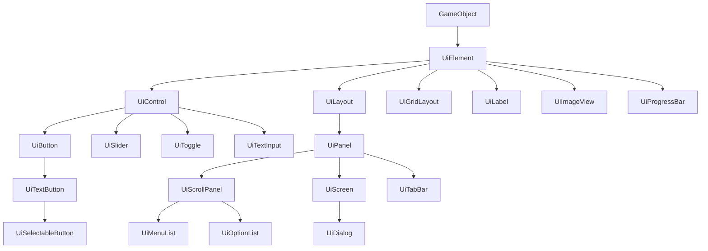

# UI 系统整体总览

## 1. 这个 UI 系统是什么

当前 `engine/ui` 是一个基于 SDL 与引擎 `GameObject` 的分层式 UI 系统。它不是单纯的一组绘图工具，而是一整套：

- UI 节点基类
- 容器与布局
- 主题与样式
- 基础控件
- 复合控件
- 整屏 UI / 对话框 / 菜单系统

共同组成的运行框架。

## 2. 系统的分层结构

## 3. 目录分工

### `base/`

定义所有 UI 对象共有的抽象能力：

- 主题挂接
- 焦点接口
- 启用/禁用

### 根目录

提供通用基础设施：

- `ui_layout.*`：线性布局树
- `ui_bar.*`：通用条形绘制工具
- `ui_fade_image.*`：独立的淡入淡出图片对象
- `ui_mouse_utils.h`：逻辑坐标鼠标读取与鼠标输入限制

### `layout/`

提供网格布局实现 `UiGridLayout`。

### `containers/`

提供可容纳子节点的 UI 容器：

- `UiPanel`
- `UiScrollPanel`
- `UiScreen`

### `style/`

负责主题角色、主题数据、样式应用器和主题管理器。

### `widgets/`

提供基础交互控件与辅助分组器：

- 按钮、文本按钮、可选按钮
- 标签、图片、进度条
- 滑条、滚动条、文本输入、开关
- 按钮组 / 多选按钮组

### `composite/`

提供由多个基础控件组合而成的高层组件：

- 标签页条
- 菜单列表
- 选项列表
- 对话框

### `animation/`

提供 `UiTransition`，给 `UiScreen` 之类的对象做开关动画。

## 4. 与引擎其余部分的依赖关系

当前 UI 系统并不是孤立存在，它强依赖以下外部基础设施：

### `GameObject`

来自 `../core/game_object.h`，提供：

- 世界坐标与尺寸
- `rect()` 矩形缓存
- 更新/渲染/输入生命周期
- 可见性、激活状态、销毁状态
- 时间缩放

这意味着 UI 元素本质上就是特殊的 `GameObject`。

### 输入系统

来自 `../input/input_system.h` 与 `../input/input_types.h`，提供：

- `InputSnapshot`
- `InputEvent`
- `InputAction`
- `InputDevice`

UI 输入的设计是“双通道”：

- `on_input`：适合鼠标轮询与拖拽
- `on_input_event` / `handle_focused_input_event`：适合键盘、手柄和文字输入事件

### 资源管理

来自 `../resources/resource_manager.h`，提供：

- 纹理查找
- 字体查找
- 音频查找

UI 中所有按 key 取资源的地方，本质都依赖 `ResourceManager::instance()`。

### SDL / SDL_ttf / SDL_mixer

当前实现直接依赖：

- `SDL_Renderer`
- `SDL_Texture`
- `SDL_Rect`
- `TTF_Font`
- `Mix_Chunk`

因此这套 UI 目前是 SDL 绑定很深的实现，不是跨渲染后端抽象。

## 5. 当前实现的关键设计思想

## 5.1 对象树优先

`UiLayout` / `UiPanel` / `UiScreen` 等容器会持有子 `GameObject`，并负责：

- 更新子节点
- 渲染子节点
- 分发输入
- 在需要时重排版

所以它更像一个小型场景树，而不是简单的“画几个按钮”。

## 5.2 样式数据与控件实现分离

主题系统把“怎么画”分成两层：

- `UiTheme`：保存主题数据
- `UiStyle`：把主题数据应用到具体控件

这让同一个控件可以：

- 使用主题外观
- 覆盖本地外观
- 在少数情况下直接使用纹理风格

## 5.3 鼠标与焦点导航分离

鼠标交互靠命中检测和当前按键状态轮询；
键盘/手柄交互靠焦点注册与事件分发。

这样做的好处是：

- 鼠标拖拽、悬停逻辑简单
- 键盘/手柄导航可以统一由 `UiScreen` 或复合控件处理

## 5.4 复合优先于继承

高层控件很少重新发明低层行为，而是直接组合：

- `UiTextButton = UiButton + 文本纹理`
- `UiSelectableButton = UiTextButton + 选中状态`
- `UiMenuList = UiScrollPanel + 多个 UiTextButton`
- `UiOptionList = UiScrollPanel + 多行 Panel/Label/Toggle/Slider`
- `UiDialog = UiScreen + Label + MenuList`

这让系统比较容易扩展。

## 6. 阅读源码时最值得先掌握的主线

如果要快速建立全局理解，建议优先抓住下面这条链：

1. `UiElement`
2. `UiControl`
3. `UiLayout`
4. `UiPanel`
5. `UiScrollPanel`
6. `UiScreen`
7. `UiButton` / `UiLabel` / `UiSlider` / `UiTextInput`
8. `UiMenuList` / `UiOptionList` / `UiDialog`

掌握这条链后，再看 `UiTheme`、`UiStyle`、`UiTransition`，会容易很多。

## 7. 当前实现的一些真实特征

- 主题刷新是懒触发的，不是全局统一刷新。
- 很多复合控件在配置变更时会“重建内部子控件树”。
- 线性布局 `UiLayout` 是系统核心；`UiGridLayout` 是一个独立的网格布局变体。
- `UiFadeImage` 是独立特效对象，不属于布局/主题/焦点体系。
- 有些组件保留了扩展点，但当前实现还没有完全接上：
  - `UiDialog` 创建了 `_action_scroll_bar`，但当前 `rebuild()` 没有把它加入子树，因此不会实际显示。

