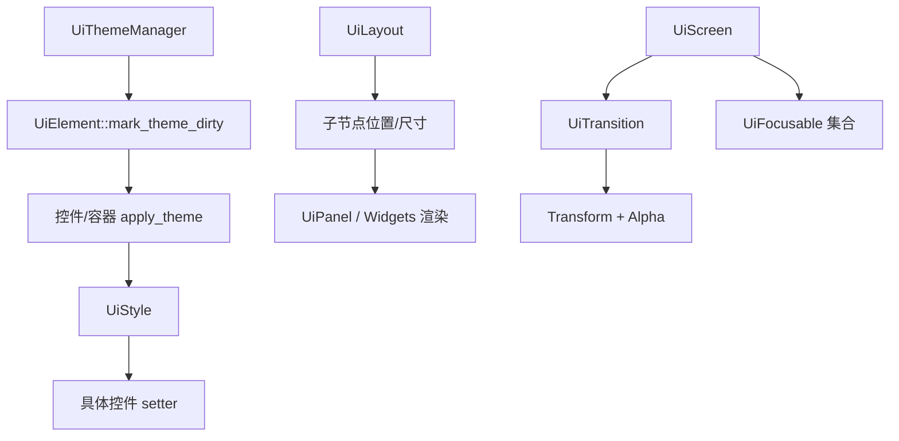

# 核心层、布局层与主题层

## 1. 基类层

## 1.1 `UiElement`

这是所有 UI 元素的共同基类，职责很纯粹：

- 继承 `GameObject`
- 自动注册/注销主题管理器
- 提供主题启用开关
- 提供脏标记与懒刷新

它不关心交互、布局、容器逻辑，只定义 UI 元素最基础的“能被主题系统管理”这一能力。

### 设计意义

- 让所有 UI 节点都具备统一主题能力
- 避免每个控件自己接入主题系统

## 1.2 `UiFocusable`

这是一个纯接口，定义：

- 能否聚焦
- 能否启用
- 接收聚焦事件输入
- 反向拿到对应 `GameObject`

它把“可聚焦输入对象”和“普通可渲染对象”解耦了。

### 设计意义

- 某些对象可以不是 `UiControl`，但仍能接入焦点导航
- `UiScreen`、`UiMenuList`、`UiTabBar` 等都能统一管理

## 1.3 `UiControl`

`UiControl` = `UiElement + UiFocusable`。

它提供：

- `_enabled`
- `_is_focused`
- 默认的启用/失焦逻辑
- 返回 `this` 作为 `GameObject*`

### 适合谁继承

- 单体交互控件
- 需要直接吃焦点事件的基础组件

## 2. 布局层

## 2.1 `UiLayout` 的作用

`UiLayout` 是当前 UI 系统最重要的骨架类，负责：

- 保存子节点
- 保存布局参数
- 自动测量内容
- 在更新/渲染/输入前保证布局是最新的
- 将生命周期分发给子节点

### 关键布局能力

- `direction`
  - 横向或纵向主轴
- `anchor`
  - 内容块在可用区域中的锚定位置
- `cross_align`
  - 子元素在交叉轴上的对齐方式
- `padding`
  - 容器内边距
- `spacing`
  - 子元素间距
- `content_offset`
  - 内容偏移，滚动面板正是利用它实现滚动
- `transform`
  - 平移和缩放
- `auto_size`
  - 根据内容反推自身尺寸

### 子元素选项 `UiLayoutChildOptions`

每个子节点可单独配置：

- margin
- 自定义交叉轴对齐
- 强制覆盖尺寸
- 是否沿交叉轴填满

这让 `UiLayout` 的灵活度已经接近常见 UI 系统中的线性布局容器。

## 2.2 `UiLayout` 的局限

它适合：

- 竖向列表
- 横向工具栏
- 带对齐和边距的普通容器

它不直接适合：

- 非规则网格
- 绝对复杂定位
- 自动换行流式布局

需要这些时，通常要扩展新容器，或使用 `UiGridLayout`。

## 2.3 `UiGridLayout`

`UiGridLayout` 是一个独立布局器，不复用 `UiLayout` 的子选项体系。

### 它的特点

- 用列数切分横向空间
- 每行高度取本行最大子元素高度
- 支持横向、纵向对齐
- 不改变子节点尺寸，只改位置

### 它和 `UiLayout` 的差异

- `UiLayout` 更通用，也更像“UI 树容器”
- `UiGridLayout` 更轻量，只做网格定位

## 3. 容器层

## 3.1 `UiPanel`

这是最基础的“可见容器”。

相对于 `UiLayout`，它新增：

- 背景色
- 边框色
- 背景纹理
- 背景 alpha
- 是否绘制背景
- 是否绘制边框
- 是否裁剪子节点
- 面板主题角色

### 何时用 `UiPanel`

- 当你需要一个可见的承载区块
- 需要背景或边框
- 需要 clip 子内容

## 3.2 `UiScrollPanel`

`UiScrollPanel` 在 `UiPanel` 基础上增加滚动语义。

### 它做的事情

- 保存滚动偏移
- 限制是否允许横向/纵向滚动
- 计算最大滚动范围
- 保证某个子元素滚动到可见范围中
- 用鼠标滚轮驱动偏移

### 它不做的事情

- 不负责绘制滚动条
- 不负责拖动 thumb

这部分交给 `UiScrollBar`。

## 3.3 `UiScreen`

`UiScreen` 是“完整屏幕级 UI 容器”的核心实现。

### 除了容器功能，它还负责

- 打开 / 关闭
- 可输入状态
- 过渡动画
- 可聚焦控件注册
- 焦点切换
- 鼠标点击切换焦点
- 键盘/手柄导航

### 为什么它重要

如果把这套 UI 看成应用层框架，那么 `UiScreen` 就是最接近“页面 / 面板 / 窗口”的对象。

## 4. 主题与样式层

## 4.1 `UiThemeRoles`

这是主题角色枚举集合，定义“一个控件在主题里扮演什么角色”。

例如：

- `UiPanelThemeRole::Dialog`
- `UiLabelThemeRole::Title`
- `UiButtonThemeRole::Primary`
- `UiBarThemeRole::Progress`

### 作用

避免控件直接硬编码颜色，而是通过角色去选取主题中的样式槽位。

## 4.2 `UiTheme`

`UiTheme` 是纯数据结构，里面放的是一整套样式值：

- `PanelStyle`
- `LabelStyle`
- `ButtonStyle`
- `BarStyle`
- `ScrollBarStyle`
- `SliderStyle`
- `ToggleStyle`
- `TextInputStyle`

以及不同语义角色对应的默认配置。

当前内置主题是：

- `make_loading_blue_theme()`

## 4.3 `UiStyle`

`UiStyle` 是“样式应用器”。

它负责把：

- 样式结构体中的字段

转成：

- 具体控件上的 setter 调用

### 设计价值

- 主题数据不需要知道控件内部实现
- 控件内部也不需要了解整个主题对象
- 样式应用逻辑集中在一个地方

## 4.4 `UiThemeManager`

主题管理器是单例，负责：

- 存当前主题
- 注册所有 `UiElement`
- 切换主题时统一标脏

### 当前实现特点

- 切主题不直接调用每个元素的 `apply_theme`
- 只统一 `mark_theme_dirty()`
- 真正套用发生在元素下次参与生命周期时

这种方式减少了立即刷新成本，也避免了递归级联更新。

## 5. 动画层

## 5.1 `UiTransition`

这是一个通用过渡插值器。

### 它存什么

- hidden state
- shown state
- current state
- duration
- elapsed
- easing
- 播放方向

### 它会做什么

- `play_forward()`
- `play_backward()`
- `jump_to_hidden()`
- `jump_to_shown()`
- `update(delta)`

### 当前使用点

主要被 `UiScreen` 用来做弹出/关闭效果。

## 6. 这几层之间如何协作

## 7. 学习这部分时的建议

- 先读 `UiElement`、`UiControl`、`UiFocusable`
- 再读 `UiLayout::apply_layout()`
- 然后看 `UiPanel::on_render()`
- 再读 `UiTheme`、`UiStyle`、`UiThemeManager`
- 最后看 `UiScreen` 如何把这些能力组合成屏幕级 UI

