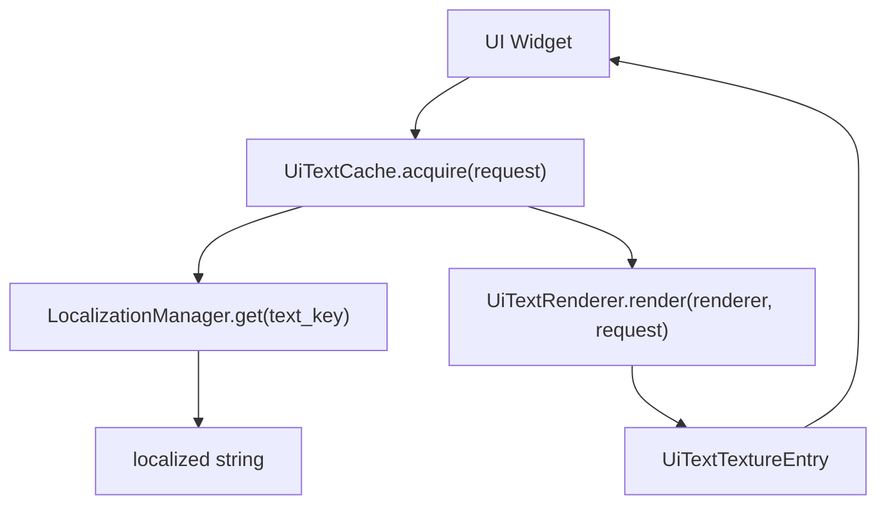
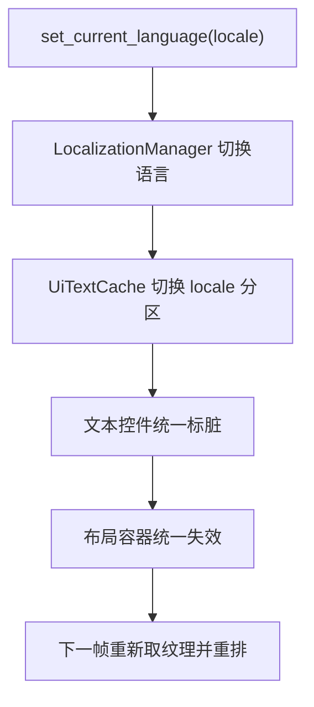

# UI 文本、本地化与纹理缓存设计

本文件整理了当前关于 UI 文案、本地化、文本转纹理、纹理缓存和控件接入方式的设计结论。目标是为后续 `engine/ui` 重构提供一份可以直接落地的实现蓝图。

## 1. 设计目标

当前 UI 系统里，文本显示逻辑分散在多个控件内部：

- `UiLabel`
- `UiTextButton`
- `UiTextInput`
- `UiToggle` 的内部标签
- `UiMenuList` / `UiOptionList` / `UiDialog` 等复合控件里的文本子控件

每个类都各自处理一部分：

- 文本内容
- 字体解析
- 文本栅格化
- 纹理生成
- 纹理缓存

这在系统还小时可以接受，但后面如果要兼容 i18n、语言切换、统一缓存策略和重复文本复用，继续分散处理会越来越难维护。

本设计希望解决四个问题：

- UI 控件不直接关心当前语言
- 文案加载与文本渲染职责分离
- 文本纹理缓存可统一管理
- 语言切换后，文本与布局都能正确刷新

## 2. 核心结论

一句话总结：

**UI 层不直接读 JSON，也不直接关心当前语言；UI 只描述“我要显示哪段文本”，本地化系统负责把 key 解析成字符串，UI 文本缓存负责把字符串渲染成纹理。**

这意味着后续结构应拆成三层：

1. `LocalizationManager`
2. `UiTextRenderer` / `UiTextRasterizer`
3. `UiTextCache`

而具体控件只负责：

- 保存文本 key 或直接文本
- 保存文本样式参数
- 在 dirty 时重新向缓存请求结果

## 3. 为什么不建议 UI 直接读 JSON

如果每个控件都自己去读 JSON，会带来这些问题：

- 控件层直接依赖资源路径和解析逻辑
- 语言切换逻辑会散落到各个 UI 类里
- 测试困难
- 缓存策略无法统一
- 文本 key、fallback、占位符格式化很难集中管理

因此更好的边界是：

- JSON 只属于本地化层
- UI 只关心 key 和显示结果

## 4. 推荐的职责划分

## 4.1 `LocalizationManager`

负责：

- 加载当前语言字典
- 提供 fallback 语言
- `key -> localized string`
- 占位符格式化
- 切换语言

不负责：

- SDL
- 字体
- 纹理
- 文本排版

推荐接口形态：

```cpp
class LocalizationManager
{
public:
    bool load_language(const std::string& locale, const std::filesystem::path& file_path);
    bool set_current_language(const std::string& locale);

    const std::string& current_language() const;
    std::string get(const std::string& key) const;
    std::string format(
        const std::string& key,
        const std::unordered_map<std::string, std::string>& params
    ) const;
};
```

## 4.2 `UiTextRenderer`

负责：

- 接收文本渲染请求
- 调用 `TTF_RenderUTF8_*`
- 从 `SDL_Surface` 创建 `SDL_Texture`
- 产出纹理和尺寸信息

不负责：

- 字典查找
- 语言切换
- 全局缓存池管理

推荐接口形态：

```cpp
struct UiTextRenderRequest
{
    std::string text;
    TTF_Font* font = nullptr;
    SDL_Color color{255, 255, 255, 255};
    int wrap_width = 0;
};

struct UiTextRenderResult
{
    TexturePtr texture;
    int width = 0;
    int height = 0;
    bool success = false;
};

class UiTextRenderer
{
public:
    static UiTextRenderResult render(SDL_Renderer* renderer, const UiTextRenderRequest& request);
};
```

## 4.3 `UiTextCache`

负责：

- 统一文本纹理缓存入口
- 按 locale 管理缓存分区
- 对外提供统一 `acquire()` 接口
- 语言切换时切换当前 locale 分区
- 控制缓存失效策略

推荐接口形态：

```cpp
struct UiTextCacheRequest
{
    std::string text_key;
    std::string fallback_text;
    TTF_Font* font = nullptr;
    SDL_Color color{255, 255, 255, 255};
    int wrap_width = 0;
};

struct UiTextTextureEntry
{
    SDL_Texture* texture = nullptr;
    int width = 0;
    int height = 0;
    uint64_t generation = 0;
};

class UiTextCache
{
public:
    std::shared_ptr<const UiTextTextureEntry> acquire(
        SDL_Renderer* renderer,
        const UiTextCacheRequest& request
    );

    void set_locale(const std::string& locale);
    const std::string& locale() const;

    void clear_locale(const std::string& locale);
    void clear_all();
};
```

## 5. 为什么推荐统一缓存接口，而不是每个控件各管一份

当前 `UiLabel`、`UiTextButton`、`UiTextInput` 都有自己的局部缓存逻辑，这会导致：

- 文本纹理生成流程重复
- 后期引入 i18n 后每个类都要改
- 重复文本无法共享
- 语言切换无法统一失效

统一缓存的好处：

- 所有文本渲染走一条路径
- 后面要调整缓存策略时只改一处
- 更容易统计和调试文本纹理数量
- 更容易为“静态文案”和“高频动态文本”做不同策略

## 6. 按钮是不是可以只保存缓存中的纹理指针

方向是对的，但建议保存：

- 缓存项引用 / 句柄
- 纹理宽高
- 可选 generation/version

不建议只保存裸 `SDL_Texture*` 指针。

原因有三个：

- 缓存清理后裸指针可能悬空
- 控件通常还需要宽高做布局或居中
- 后面如果做缓存淘汰，裸指针很难安全管理

所以更推荐控件保存：

```cpp
std::shared_ptr<const UiTextTextureEntry> _text_entry;
bool _text_dirty = true;
```

然后在 dirty 时重新请求：

```cpp
if (_text_dirty)
{
    _text_entry = ui_text_cache.acquire(renderer, request);
    _text_dirty = false;
}
```

## 7. 按语言拆纹理缓存池可以吗

可以，而且这比让按钮知道当前语言更好。

但更准确地说，推荐做成：

**统一的 `UiTextCache` 接口，内部按 locale 分区管理。**

外部控件不应直接知道：

- 当前语言是什么
- 当前使用哪一个语言池
- JSON 文件从哪加载

控件只需要：

- 保存 `text_key`
- 保存文本渲染参数
- dirty 时重新 `acquire()`

缓存内部则负责：

- 当前 locale
- `text_key -> localized string`
- `localized string -> texture`
- locale 分区缓存切换

## 8. 为什么不建议所有语言纹理都长期全量常驻

字典可以按语言加载，甚至当前语言可以在启动时全量加载；
但“所有语言的所有文本纹理都预先建好并常驻”通常不划算。

问题包括：

- 启动时间变长
- 显存和内存浪费
- 很多文案根本不会在本次会话出现
- 一些文本带 wrap、颜色、字体变化，组合数会膨胀

因此推荐策略是：

- 当前语言字典：可在启动时加载
- 当前语言文本纹理：按需生成
- 其他语言纹理分区：懒创建
- 旧语言纹理分区：可保留，也可清理，取决于切语言频率和内存预算

## 9. 当前语言切换后要注意什么

语言切换不是“只换文字纹理”这么简单。

对于当前 UI 系统来说，语言切换至少要触发两种失效：

1. 文本纹理失效
2. 布局失效

原因是：

- 文本内容变了，纹理一定要重新生成
- 文本长度变了，`UiLabel`、`UiTextButton` 等的尺寸可能变化
- 当前布局系统依赖 `UiLayout` 的布局脏标记决定是否重排

如果只刷新纹理、不重排布局，就可能出现：

- 文本溢出
- 按钮内容不居中
- 对话框标题或菜单项错位
- auto-size 结果变化但父布局没重新计算

因此语言切换流程建议是：

1. `LocalizationManager::set_current_language(locale)`
2. `UiTextCache::set_locale(locale)`
3. 所有文本型控件标记 `_text_dirty = true`
4. 相关布局容器也标记 `_layout_dirty = true`
5. 下一帧或下一次渲染时重新请求纹理并重排

## 10. 哪些控件适合共享文本缓存

更适合共享缓存的：

- `UiLabel`
- `UiTextButton`
- `UiMenuList` 中稳定的菜单文案
- `UiTabBar`
- `UiDialog` 标题和动作文案

不太适合强行进全局共享缓存的：

- `UiTextInput`
- 频繁变化的数值文本
- 高速变化的调试信息

这些对象更适合：

- 保留局部缓存
- 或在统一接口下使用“短生命周期、不共享”的缓存策略

所以未来最好不要只有一种缓存模式，而是至少有两种：

- 共享静态文本缓存
- 非共享动态文本缓存

## 11. 推荐的目录组织

可以在 `engine/ui` 下增加一个文本相关子目录，例如：

```text
engine/ui/text/
  ui_text_render_types.h
  ui_text_renderer.h
  ui_text_renderer.cpp
  ui_text_cache.h
  ui_text_cache.cpp
  ui_localized_text.h
```

如果本地化不只 UI 用，也可以把 `LocalizationManager` 放到更通用的位置，例如：

```text
engine/localization/
  localization_manager.h
  localization_manager.cpp
```

这样边界更清晰：

- `localization/` 负责 key 到 string
- `ui/text/` 负责 string 到 texture
- `ui/widgets/` 负责控件显示和交互

## 12. 推荐的控件接入方式

## 12.1 `UiLabel`

建议从：

- 自己持有 `_texture`
- 自己做 `refresh_texture()`

逐步改成：

- 持有 `_text_entry`
- 维护 `_text_dirty`
- dirty 时从 `UiTextCache` 请求

## 12.2 `UiTextButton`

建议不再自己持有 `_message_texture` 的生成逻辑，而是：

- 组装 `UiTextCacheRequest`
- 请求缓存项
- 把缓存项里的 `texture` 作为 message texture 使用

## 12.3 `UiTextInput`

不建议第一步完全塞进共享缓存池。

更好的方式是：

- 共用 `UiTextRenderer`
- 但保留更局部的缓存策略
- 后续如果需要，再给它接统一 `UiTextCache` 的“非共享模式”

## 13. 推荐的数据流



语言切换时：



## 14. 实施建议

推荐按这个顺序落地：

1. 先抽出 `UiTextRenderer`
2. 让 `UiLabel` / `UiTextButton` 先共用文字转纹理流程
3. 再引入 `LocalizationManager`
4. 再引入 `UiTextCache`
5. 再让 `UiLabel` / `UiTextButton` 从局部缓存迁到共享缓存
6. 最后再评估 `UiTextInput` 是否需要接入统一缓存接口

这个顺序的好处是：

- 风险小
- 每一步都能独立验证
- 不会一开始就把 i18n、缓存、控件改造一起耦合爆炸

## 15. 最终建议

最终推荐结构是：

- UI 不直接读 JSON
- UI 不直接知道当前语言
- UI 有统一文本转纹理模块
- UI 有统一文本缓存接口
- 缓存内部按 locale 分区
- 控件保存缓存项引用，不保存不受控裸指针
- 语言切换后同时触发文本刷新和布局失效

一句话总结：

**最合适的长期方案不是“按钮自己管文字纹理”，也不是“按钮自己知道当前语言”，而是“本地化层管文案，UI 文本缓存层管纹理，按钮只请求结果并在 dirty 时刷新”。**

